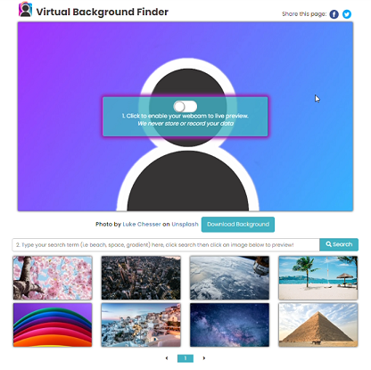
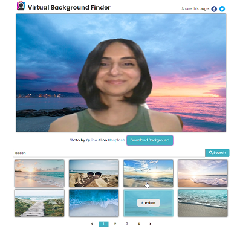
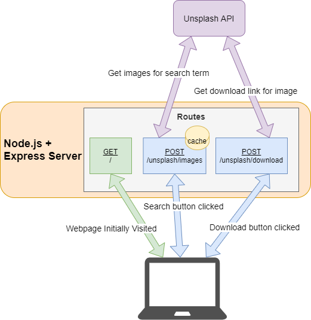

# VirtualBackgroundPicker
The virtual background picker allows you to easily find and test virtual backgrounds from your browser! It relies on the BodyPix model for person segmentation to remove your body from your webcam feed, and overlay it on a previewed virtual background.
Images are provided through the Unsplash API, with a NodeJs/ExpressJs server acting as a proxy to maintain out Unsplash API key. Postgres is used as a persistent cache between deployments. 

## Architectural Diagram
